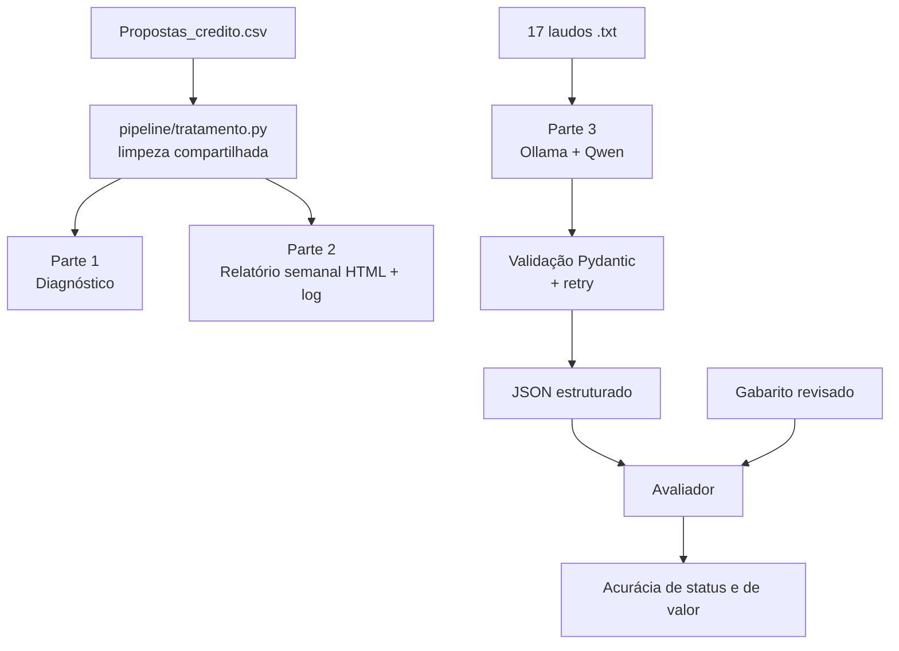

# Banco Bari — AI & Data Lab Case

Solução do desafio prático do **Banco Bari — AI & Data Lab**, com base em dados sintéticos de propostas de crédito com imóvel em garantia (*home equity*).

| Parte | O que faz | Onde está |
|---|---|---|
| 1. Diagnóstico | Limpa a base, mede onde o funil perde valor e testa as hipóteses da liderança | [`parte1_diagnostico/`](parte1_diagnostico/) |
| 2. Automação | Gera um relatório HTML semanal do funil a partir do CSV bruto, com log | [`parte2_automacao/`](parte2_automacao/) |
| 3. Extração com IA | Extrai 10 campos de 17 laudos em texto livre com um LLM local e mede a acurácia | [`parte3_extracao_ia/`](parte3_extracao_ia/) |
| 4. Diário | Uso de IA, aprendizado e autocrítica | [`DIARIO.md`](DIARIO.md) |
| Resumo executivo | 1 página para a liderança comercial | [`RESUMO_EXECUTIVO.pdf`](RESUMO_EXECUTIVO.pdf) |

**Sugestão de leitura:** resumo executivo → este README → [`04_respostas_parte1.md`](parte1_diagnostico/04_respostas_parte1.md) → [`registro_tratamento.md`](parte1_diagnostico/registro_tratamento.md) → [`decisoes.md`](parte3_extracao_ia/decisoes.md) → [`DIARIO.md`](DIARIO.md).

---

## Início rápido

Requer Python 3.11+. Na raiz do repositório:

```bash
git clone https://github.com/vicvictorius/bari-case.git
cd bari-case
python -m venv .venv
.venv\Scripts\Activate.ps1          # Windows (PowerShell)
# source .venv/bin/activate         # Linux/macOS
pip install -r requirements.txt
```

| Para | Comando | Resultado |
|---|---|---|
| Rodar os testes | `python -m pytest -q` | `169 passed` (não requer Ollama nem API) |
| Gerar o relatório semanal | `python parte2_automacao/relatorio_semanal.py --data-referencia 2025-10-27` | `parte2_automacao/saidas/relatorio_2025-10-20_2025-10-26.html` + `.log` |
| Reproduzir a Parte 1 | ver [Parte 1](#parte-1--diagnóstico-do-funil) | saídas idênticas aos `*_output.txt` versionados |
| Rodar a extração | requer Ollama; ver [`parte3_extracao_ia/README.md`](parte3_extracao_ia/README.md) | JSON estruturado + relatório de acurácia |

> **Atenção à data do relatório:** a base sintética termina em dezembro de 2025. Rodar a Parte 2 sem `--data-referencia` usa a semana atual, gera um relatório vazio e sai com código `3` (base possivelmente desatualizada). É o comportamento esperado, não um erro.

---

## Principais resultados

**Funil**
- Conversão geral: **19,39%**. Em ~2 anos, **R$ 2,0 bilhões** em crédito solicitado não viraram contrato.
- A **Análise de Crédito (etapa 3)** concentra a maior parte: **R$ 703 milhões (35,1%)**. Dois terços disso (1.191 propostas, R$ 471,7 mi) são desistência ou falta de retorno do cliente, não reprovação.
- No funil inteiro, desistência e falta de retorno somam **60,8%** do valor não contratado.

**Hipóteses da liderança**
- **Canal Correspondente — confirmado:** converte **14,3%**, contra **21,3%** nos demais canais (p < 0,0001), e converte menos em todas as faixas de score. O score dos clientes explica só ~1,2 dos 7,1 p.p. de diferença.
- **Queda de conversão — não comprovada:** 20,4% (2024) → 18,7% (coortes maduras de jan–out/2025), com p ≈ 0,10. É um sinal a acompanhar.

**Associações com a contratação:** score de crédito (amplitude de 30,4 p.p.), seguido por LTV e canal. Região aparece com 5,8 p.p., mas não é significativa (qui-quadrado, p ≈ 0,23). São associações, não causas.

**Recomendações**

| # | Ação | Oportunidade estimada |
|---|---|---|
| 1 | Follow-up ativo durante a Análise de Crédito | ~119 contratos / R$ 47 mi, se 10% das desistências da etapa 3 fossem recuperadas |
| 2 | Revisar o canal Correspondente | ~126 contratos / R$ 48 mi, se o canal convertesse como a média dos outros |
| 3 | Validar a regra de LTV de 60% antes de automatizar um bloqueio | 124 contratos foram fechados acima de 60% |

Os valores são cenários de oportunidade sob as premissas indicadas, não previsões de receita.

**Extração com IA (Qwen2.5 7B, execução atual):** **90,0%** de acurácia de status e **82,5%** de acurácia de valor, com 16 de 17 laudos processados. Campos textuais (`endereco`, `matricula`, `onus`) ainda exigem revisão humana.

---

## Arquitetura



A limpeza das propostas fica num único módulo, usado pela Parte 1 e pela Parte 2. Assim, o número do relatório semanal é calculado exatamente como o da análise.

---

## Estrutura do projeto

```text
bari-case/
├── dados_brutos/                 # arquivos originais, nunca alterados
│   ├── Propostas_credito.csv
│   └── laudos_avaliacao/         # 17 laudos .txt
├── pipeline/
│   └── tratamento.py             # regras de limpeza (Partes 1 e 2)
├── parte1_diagnostico/
│   ├── 00_profiling.py … 06_robustez_associacoes.py   # scripts, em ordem
│   ├── *_output.txt              # saídas versionadas dos scripts
│   ├── propostas_credito_tratado.csv
│   ├── registro_tratamento.md    # cada problema de dado e a decisão tomada
│   ├── definicao_metricas.md     # por que conversão e valor perdido foram definidos assim
│   └── 04_respostas_parte1.md    # respostas às 4 perguntas
├── parte2_automacao/
│   ├── relatorio_semanal.py
│   ├── saidas/                   # exemplos de relatório (semana com dados e semana vazia)
│   ├── testes/
│   └── README.md                 # contrato de entrada, erros, agendamento
├── parte3_extracao_ia/
│   ├── schema.py                 # contrato dos 10 campos (valor, status, trecho_bruto)
│   ├── normalizacao.py           # conversão estrita texto → número/data
│   ├── extrator_local.py         # extração via Ollama (usada nos resultados)
│   ├── extrator.py               # alternativa via API Anthropic (não executada)
│   ├── avaliador.py              # compara com o gabarito
│   ├── construir_gabarito.py, gabarito.json
│   ├── saida_*.json, falhas_*.json, relatorio_acuracia_*.md   # artefatos das execuções
│   ├── evidencia_falha_laudo_1.md
│   ├── decisoes.md               # decisões, erros encontrados e limitações
│   ├── testes/
│   └── README.md                 # como rodar e histórico das execuções
├── DIARIO.md
├── PLANO.md                      # planejamento inicial
├── RESUMO_EXECUTIVO.md / .pdf
└── requirements.txt
```

---

## Parte 1 — Diagnóstico do funil

**Fluxo:** profiling → tratamento → definição das métricas → diagnóstico → recomendações.

**Princípio do tratamento:** descartar linha muda o resultado. Nenhuma linha foi removida; cada problema foi isolado na coluna afetada e registrado com a justificativa em [`registro_tratamento.md`](parte1_diagnostico/registro_tratamento.md). Exemplos: etapa 7 corrigida para 6 só porque status, assinatura e taxa confirmavam contrato; idade de 14 anos virou nula; assinatura anterior à entrada foi mantida e sinalizada, porque não dá para saber qual data está errada.

**Maturidade das coortes:** a comparação 2024 × 2025 usa só propostas de janeiro a outubro de 2025, porque as mais recentes ainda não tiveram tempo de chegar ao fim do funil.

**Reproduzir:**

```bash
python parte1_diagnostico/00_profiling.py > parte1_diagnostico/00_profiling_output.txt
python parte1_diagnostico/01_tratamento.py
python parte1_diagnostico/02_comparacao_metricas.py
python parte1_diagnostico/03_diagnostico_funil.py > parte1_diagnostico/03_diagnostico_output.txt
python parte1_diagnostico/05_teste_significancia.py > parte1_diagnostico/05_teste_significancia_output.txt
python parte1_diagnostico/06_robustez_associacoes.py > parte1_diagnostico/06_robustez_associacoes_output.txt
```

| Script | Produz |
|---|---|
| `00_profiling.py` | diagnóstico dos problemas da base bruta |
| `01_tratamento.py` | `propostas_credito_tratado.csv`, via `pipeline/tratamento.py` |
| `02_comparacao_metricas.py` | comparação de duas definições de valor perdido |
| `03_diagnostico_funil.py` | números que sustentam as respostas |
| `05_teste_significancia.py` | teste z das diferenças de conversão (Pergunta 2) |
| `06_robustez_associacoes.py` | Correspondente por faixa de score e qui-quadrado de canal, UF e tipo de imóvel |

> No Windows PowerShell 5.1, o operador `>` grava em UTF-16. Os arquivos gerados assim terão o mesmo conteúdo, mas o Git os mostrará como alterados.

---

## Parte 2 — Relatório semanal automático

```text
CSV bruto → validação → limpeza compartilhada → métricas da semana → HTML → log
```

| Situação | Comportamento |
|---|---|
| Coluna essencial ausente (usada nas métricas) | para com erro claro no log |
| Coluna opcional ausente (ex.: `consultor_id`) | registra aviso e segue |
| Separador `;` ou `,`, datas BR ou ISO, `R$` | aceitos |
| Outros formatos, IDs duplicados, CSV vazio | param com erro claro; o HTML anterior é preservado |
| Erro de dado conhecido em qualquer linha | corrigido por regra genérica e registrado no log com os IDs |
| Semana sem propostas / base desatualizada | HTML com alerta; código de saída `3` |

**Códigos de saída:** `0` sucesso · `1` falha · `2` argumentos inválidos · `3` base possivelmente desatualizada.

**Como ler o relatório:** as semanas são coortes por `data_entrada`, com o status disponível no arquivo. A "conversão da semana" é: das propostas que entraram naquela semana, quantas viraram contrato até hoje. Não é o número de contratos assinados na semana.

O HTML é autocontido (sem CDN nem servidor), tem filtros por canal e etapa, distingue "sem dados" de "0%" e é adequado para impressão. Exemplos em [`saidas/`](parte2_automacao/saidas/): uma semana com dados (`relatorio_2025-10-20_2025-10-26.html`) e uma semana vazia com alerta (`relatorio_2026-09-14_2026-09-20.html`).

Agendamento toda segunda-feira, opções da linha de comando e contrato completo de entrada: [`parte2_automacao/README.md`](parte2_automacao/README.md).

---

## Parte 3 — Extração estruturada com IA

Cada um dos 10 campos (tipo de imóvel, endereço, áreas privativa e total, ano de construção, valor de avaliação, matrícula, ônus, data da vistoria e responsável técnico) é extraído neste formato:

```json
"ano_construcao": { "valor": null, "status": "ausente", "trecho_bruto": "Idade: aproximadamente 18 anos" }
```

- `status` é `presente`, `ausente` ou `conflitante`: **o extrator não chuta**.
- `trecho_bruto` guarda o texto do laudo que justifica a decisão, para auditoria.
- A resposta do modelo é validada com Pydantic (tipos, faixas e regras como "`presente` exige valor"). Se for inválida, o erro volta ao modelo, com até 3 tentativas. Se ainda falhar, o laudo aparece na saída como `nao_extraido`, para revisão humana.
- A conversão de texto para número e data é feita por código determinístico, não pelo LLM.

**Avaliação:** um gabarito dos 17 laudos (rascunho com IA, revisado manualmente) é comparado com a extração em duas métricas: **status** (acertou se o campo existe?) e **valor** (quando existe, acertou o conteúdo?).

| Qwen2.5 7B | Status | Valor | Laudos |
|---|---:|---:|---:|
| Primeira versão (tudo como texto) | 92,9% | 63,6% | 17/17 |
| **Versão atual** (campos tipados, prompt revisado, validação textual) | **90,0%** | **82,5%** | **16/17** |

Na versão atual, áreas, valor, ano, data e responsável técnico acertam 100% do valor; `endereco` (26,7%), `matricula` (40,0%) e `onus` (66,7%) ainda exigem revisão humana. O modelo Qwen3 1.7B foi usado primeiro por limitação de hardware (GPU de 2 GB).

Histórico completo das execuções, resultados por campo, investigação da falha do `laudo_1` e como rodar: [`parte3_extracao_ia/README.md`](parte3_extracao_ia/README.md). Decisões de modelagem e erros encontrados: [`decisoes.md`](parte3_extracao_ia/decisoes.md).

---

## Testes

```bash
python -m pytest -q                        # 169 testes
python -m pytest parte2_automacao/testes   # 54 — Parte 2 e pipeline compartilhado
python -m pytest parte3_extracao_ia/testes # 115 — Parte 3
```

Cobrem principalmente: validação do CSV e mudanças de formato; regras genéricas do pipeline (origem já corrigida, mesmo erro em outra linha, colunas ausentes); geração segura do HTML, estados vazios e filtros; schema, conversão estrita e retry da extração; o avaliador; e regressões dos erros encontrados nas execuções reais. Nenhum teste precisa de Ollama ou de acesso à API.

---

## Limitações

- As oportunidades financeiras são cenários sob premissas, não previsões.
- As associações da Parte 1 são descritivas; a estratificação do Correspondente controla só o score.
- O relatório semanal é retrospectivo: a base não tem histórico de mudanças de status.
- A avaliação da Parte 3 usa só 17 laudos, e o prompt foi ajustado com base neles. Os números são otimistas para laudos novos.
- O gabarito teve rascunho de IA e revisão de uma única pessoa.
- O schema não distingue informação declarada por uma fonte não verificada (ex.: "segundo o proprietário"); a evolução proposta é um status `nao_verificado`.
- A implementação via API Anthropic foi testada com cliente simulado, mas não executada contra a API real.

Detalhes no [`DIARIO.md`](DIARIO.md) e no [`decisoes.md`](parte3_extracao_ia/decisoes.md).

---

## Uso de IA

IA foi usada como **assistente de desenvolvimento** (Claude, e ChatGPT na etapa final) e como **componente da solução** (Qwen via Ollama). As sugestões foram verificadas contra os dados, o comportamento do pipeline e os testes. Erros concretos encontrados e o que foi feito com cada um estão no [`DIARIO.md`](DIARIO.md).

---

## Tempo de desenvolvimento

O tempo não foi cronometrado. A estimativa foi **reconstruída a partir dos horários dos commits**: duas sessões contínuas, somando cerca de **17h**:

- 25/09, ~19h, até 26/09, ~05h (~10h);
- 26/09, ~15h30, até ~22h15 (~6h45).

Os intervalos sem commits (o maior deles das 00h54 às 04h24) foram usados para estudo e desenvolvimento, em paralelo às execuções dos modelos locais, que rodavam principalmente em CPU.

| Etapa | Tempo aproximado |
|---|---:|
| Parte 1 — Profiling, tratamento, diagnóstico e refinamentos | 4h–4h30 |
| Parte 2 — Automação e interface do relatório | 2h30–3h |
| Parte 3 — Extração, avaliação, estudo e iterações de schema/prompt | 7h–8h |
| Parte 4 — Diário, resumo executivo e documentação | 2h |
| Revisão final contra o enunciado | 1h |
| **Total** | **~17h** |

---

## Tecnologias

Python 3 · pandas · SciPy · Pydantic · pytest · Ollama (Qwen3 1.7B, Qwen2.5 7B) · Anthropic SDK · HTML/JavaScript · Git/GitHub

---

## Fontes externas

Nenhum dado externo entrou nas análises: todos os números vêm dos arquivos fornecidos. As referências abaixo sustentam decisões ou ferramentas usadas:

- **Taxa Selic:** usada só como ordem de grandeza para interpretar `taxa_juros_aa` como % ao mês (registro de tratamento, item 8). Histórico oficial do Banco Central do Brasil: <https://www.bcb.gov.br/controleinflacao/historicotaxasjuros>.
- **Ollama:** execução local dos modelos da Parte 3: <https://ollama.com>.
- **Qwen2.5 7B Instruct** e **Qwen3 1.7B:** modelos usados na extração. Model cards: <https://huggingface.co/Qwen/Qwen2.5-7B-Instruct> e <https://huggingface.co/Qwen/Qwen3-1.7B>.
- **Testes estatísticos:** teste z de duas proporções (implementado com a biblioteca padrão em `05_teste_significancia.py`) e qui-quadrado de independência (`scipy.stats.chi2_contingency`, <https://docs.scipy.org/doc/scipy/reference/generated/scipy.stats.chi2_contingency.html>).
- **Claude (Anthropic):** assistente de desenvolvimento; o uso está documentado em `DIARIO.md`.

---

## Dados e autor

Todos os dados são **sintéticos**, fornecidos para o processo seletivo. Nenhum dado real de cliente foi usado.

**Victor** · GitHub: [vicvictorius](https://github.com/vicvictorius)
