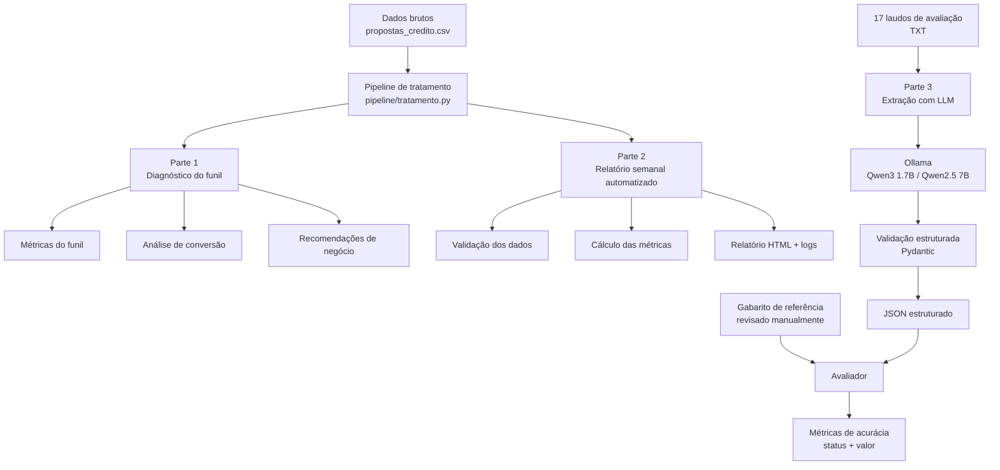

# Banco Bari — AI & Data Lab Case

Solução desenvolvida para o desafio prático do **Banco Bari — AI & Data Lab**.

O projeto analisa dados sintéticos de propostas de Home Equity, automatiza o acompanhamento semanal do funil e utiliza IA para transformar laudos de avaliação em dados estruturados.

O objetivo não foi apenas produzir análises, mas construir um processo **reproduzível, testável e auditável**, documentando também limitações, decisões de engenharia e uso de IA durante o desenvolvimento.

---

## Principais resultados

A análise do funil encontrou uma conversão geral de **19,39%**.

Os principais achados foram:

- **Análise de crédito (etapa 3)** concentra **35,1% do valor solicitado não contratado**, aproximadamente **R$ 703 milhões**.
- Considerando as perdas do funil por motivo, **60,8% do valor solicitado não contratado** está associado a desistência ou falta de retorno do cliente, e não diretamente à reprovação de crédito.
- A conversão observada passou de **20,4% em 2024 para 18,7% nas coortes maduras de Jan–Out/2025**, mas essa diferença **não é estatisticamente significativa** (teste z de duas proporções, p ≈ 0,10; IC 95% da diferença de −3,6 a +0,3 p.p.). É um sinal fraco a acompanhar, não uma queda comprovada.
- O canal **Correspondente** apresentou conversão de **14,3%**, contra **21,3%** nos demais canais somados (p < 0,0001), enquanto aumentou sua participação no volume. Esse é o sinal mais robusto da análise.
- **Score de crédito** apresentou a maior associação observada com contratação, com amplitude de **30,4 pontos percentuais** entre grupos analisados, seguido por LTV e canal de origem.

Essas relações são **associações observadas nos dados**, não evidência de causalidade.

### Recomendações

**1. Follow-up ativo durante a análise de crédito**

A etapa 3 concentra **1.191 propostas** perdidas por `Sem retorno` ou `Desistiu`, que representam aproximadamente **R$ 471,7 milhões** em valor solicitado.

Em um cenário de sensibilidade no qual uma intervenção de processo recuperasse 10% desse valor, a oportunidade seria equivalente a aproximadamente **119 propostas e R$ 47,2 milhões** em crédito adicional ao longo do período analisado.

**2. Revisar o canal Correspondente**

O canal apresentou conversão inferior aos demais e participação crescente no volume.

Em um cenário no qual sua conversão alcançasse a média observada nos outros canais, a oportunidade associada seria de aproximadamente **126 propostas e R$ 48 milhões** em crédito adicional.

Essa estimativa é um cenário contrafactual descritivo e não demonstra que o canal seja a causa da diferença observada.

**3. Validar e operacionalizar a política de LTV de 60%**

A base contém **981 propostas com LTV calculado acima de 60%**, das quais **124 aparecem como contratadas**.

Antes de implementar um bloqueio automático, é necessário validar se o LTV disponível na base representa exatamente a mesma medida utilizada pela política de crédito e investigar possíveis exceções, renegociações ou mudanças de condição durante o processo.

> Os valores apresentados são cenários de oportunidade condicionados às premissas da análise, não previsões de receita nem efeitos causais medidos.

---

## Arquitetura da solução

A solução foi organizada em dois fluxos principais:

- **dados estruturados**, utilizados no diagnóstico e na automação do funil de crédito;
- **dados não estruturados**, utilizados na extração de informações dos laudos com LLMs.

O tratamento das propostas foi centralizado em um pipeline compartilhado, permitindo que o diagnóstico da Parte 1 e o relatório automatizado da Parte 2 utilizem as mesmas regras de preparação dos dados.



O primeiro fluxo busca manter consistência entre análise exploratória e automação, enquanto o segundo adiciona validação estrutural e uma etapa explícita de avaliação das extrações produzidas pelos modelos.

---

# Estrutura do projeto

```text
bari-case/
│
├── dados_brutos/
│   ├── Propostas_credito.csv
│   └── laudos_avaliacao/
│
├── pipeline/
│   ├── __init__.py
│   └── tratamento.py
│
├── parte1_diagnostico/
│   ├── 00_profiling.py
│   ├── 00_profiling_output.txt
│   ├── 01_tratamento.py
│   ├── 02_comparacao_metricas.py
│   ├── 03_diagnostico_funil.py
│   ├── 03_diagnostico_output.txt
│   ├── 04_respostas_parte1.md
│   ├── 05_teste_significancia.py
│   ├── 05_teste_significancia_output.txt
│   ├── definicao_metricas.md
│   ├── propostas_credito_tratado.csv
│   └── registro_tratamento.md
│
├── parte2_automacao/
│   ├── README.md
│   ├── relatorio_semanal.py
│   ├── saidas/
│   └── testes/
│
├── parte3_extracao_ia/
│   ├── schema.py
│   ├── normalizacao.py
│   ├── extrator.py
│   ├── extrator_local.py
│   ├── avaliador.py
│   ├── construir_gabarito.py
│   ├── gabarito.json
│   ├── decisoes.md
│   ├── README.md
│   ├── relatorio_acuracia_qwen25-7b.md
│   ├── saida_extracao_local_qwen25-7b.json
│   ├── relatorio_acuracia_qwen25-7b-tipado-prompt-v2-normalizado.md
│   ├── saida_extracao_local_qwen25-7b-tipado-prompt-v2.json
│   ├── saida_extracao_local_qwen25-7b-tipado-prompt-v2-textual.json
│   ├── relatorio_acuracia_qwen25-7b-tipado-prompt-v2-textual.md
│   ├── falhas_saida_extracao_local_qwen25-7b-tipado-prompt-v2-textual.json
│   └── testes/
│
├── DIARIO.md
├── PLANO.md
├── RESUMO_EXECUTIVO.md
├── RESUMO_EXECUTIVO.pdf
├── requirements.txt
└── README.md
```

---

# Parte 1 — Diagnóstico do funil

A primeira etapa realiza profiling, tratamento e análise das propostas de crédito.

O fluxo foi separado em:

```text
dados brutos
    ↓
profiling
    ↓
tratamento
    ↓
definição das métricas
    ↓
diagnóstico do funil
    ↓
recomendações
```

As transformações realizadas são registradas em:

```text
parte1_diagnostico/registro_tratamento.md
```

As respostas consolidadas da Parte 1 estão em:

```text
parte1_diagnostico/04_respostas_parte1.md
```

Uma preocupação durante essa etapa foi evitar que a limpeza dos dados alterasse silenciosamente os resultados do negócio.

Por isso, foram feitas comparações entre métricas antes e depois do tratamento.

Também foi considerada a maturidade temporal das coortes. Propostas recentes podem ainda estar percorrendo o funil, portanto coortes imaturas não devem ser comparadas diretamente com períodos que já tiveram tempo suficiente para atingir um desfecho.

---

# Parte 2 — Automação do relatório semanal

A Parte 2 transforma a análise em um processo automatizado.

O pipeline recebe o CSV bruto, valida sua estrutura, aplica o mesmo tratamento compartilhado utilizado no diagnóstico e gera um relatório HTML semanal do funil.

```text
CSV bruto
    ↓
validação
    ↓
tratamento compartilhado
    ↓
cálculo das métricas
    ↓
relatório HTML
    ↓
log da execução
```

A automação possui tratamento explícito para situações como:

- colunas ausentes;
- formatos inválidos;
- IDs duplicados;
- registros incompletos;
- CSV vazio;
- mudanças de schema;
- semana sem propostas;
- possível base desatualizada;
- falhas durante a geração do relatório;
- reexecução do pipeline.

## Semântica temporal

O relatório utiliza coortes definidas pela `data_entrada`, considerando semanas completas de segunda-feira a domingo.

A leitura é **retrospectiva**: os desfechos apresentados são os disponíveis no arquivo utilizado na execução, inclusive quando ocorreram depois da semana selecionada.

Portanto, o relatório **não representa o status que era conhecido historicamente naquela semana nem a quantidade de contratos assinados durante aquela semana**.

Essa distinção é necessária porque a base não contém um histórico completo de mudanças de status que permita reconstruir exatamente o estado de cada proposta em uma data passada.

O acumulado considera propostas com entrada até o domingo da semana selecionada.

## Relatório e filtros

A interface permite filtrar a semana selecionada por:

- canal de origem;
- última etapa alcançada.

Para reduzir ambiguidade, o relatório diferencia explicitamente:

- **Semana selecionada — responde aos filtros**
- **Semana completa — sem filtros**

Os filtros atualizam os indicadores correspondentes à semana selecionada. Semana anterior, acumulado e demais análises mantêm seu contexto original.

As combinações utilizadas pelos filtros são pré-calculadas em Python e disponibilizadas ao relatório. O JavaScript é responsável pela atualização da interface, evitando manter uma segunda implementação independente das regras analíticas no navegador.

## Estados vazios e alertas

O relatório diferencia ausência de observações de uma taxa igual a zero.

Quando não existem propostas para o recorte analisado, por exemplo, a conversão é apresentada como:

```text
Não aplicável
```

em vez de `0,00%`.

Também existem:

- **notas metodológicas permanentes**, que explicam como interpretar o relatório;
- **alertas dinâmicos**, exibidos quando uma condição específica pode afetar a interpretação, como ausência de propostas na semana ou possível desatualização da base.

Os alertas são apresentados sem duplicar as notas metodológicas.

## Interface final

O redesign final do relatório melhorou:

- hierarquia visual;
- organização dos filtros;
- leitura dos KPIs;
- comparação entre períodos;
- visualização das perdas;
- alertas;
- estados vazios;
- responsividade;
- impressão/PDF.

As mudanças de interface foram realizadas sem alterar:

- cálculos;
- métricas;
- regras de negócio;
- tratamento compartilhado;
- semântica temporal;
- comportamento funcional dos filtros.

O relatório permanece autocontido e não depende de frameworks ou CDNs externos para sua apresentação.

Um exemplo de saída está disponível em:

```text
parte2_automacao/saidas/relatorio_2026-09-14_2026-09-20.html
```

A documentação específica da automação está em:

```text
parte2_automacao/README.md
```

---

# Parte 3 — Extração estruturada com IA

A terceira etapa transforma **17 laudos de avaliação em texto livre** em dados estruturados.

São extraídos 10 campos:

- tipo de imóvel;
- endereço;
- área privativa;
- área total;
- ano de construção;
- valor de avaliação;
- matrícula;
- ônus;
- data da vistoria;
- responsável técnico.

Cada campo possui uma estrutura contendo:

```text
valor
status
trecho_bruto
```

O `trecho_bruto` preserva evidência textual do documento para permitir auditoria dos resultados.

## Critério de avaliação

Foi construído um **gabarito de referência** para os 17 laudos.

O rascunho inicial do gabarito teve apoio de IA e foi posteriormente revisado manualmente por uma pessoa. Portanto, ele é utilizado como referência para o experimento, mas não deve ser interpretado como um *gold standard* humano totalmente independente.

O avaliador compara cada campo extraído com esse gabarito e normaliza representações equivalentes de números e datas antes de classificá-las como divergências.

Essa abordagem permite separar dois problemas diferentes:

1. o modelo identificou corretamente se a informação estava presente, ausente ou conflitante?
2. quando presente, o valor extraído estava correto?

Isso evita considerar uma extração correta apenas porque o modelo produziu uma saída estruturalmente válida.

## Qwen3 1.7B

A primeira execução completa utilizou **Qwen3 1.7B** via Ollama.

Resultado:

```text
17/17 laudos processados
92,4% de acurácia de status
```

O modelo menor foi escolhido inicialmente devido à limitação de hardware disponível, uma NVIDIA GT 1030 com 2 GB de VRAM.

Essa execução também revelou problemas importantes no próprio pipeline, incluindo uma validação que permitia `status="presente"` com `valor=None` e limitações na normalização utilizada pelo avaliador.

Esses problemas foram corrigidos e transformados em testes de regressão.

## Qwen2.5 7B

Posteriormente, o mesmo experimento foi executado em uma máquina com NVIDIA RTX 3050 de 4 GB utilizando **Qwen2.5 7B**.

| Execução — Qwen2.5 7B | Acurácia de status | Acurácia de valor condicional | Laudos processados |
|---|---:|---:|---:|
| Schema antigo (`valor` sempre texto) | 92,9% (158/170) | 63,6% (91/143) | 17/17 |
| Schema tipado | 84,7% | 77,3% (99/128) | 16/17 |
| Schema tipado + prompt V2 | 90,6% | 80,9% (114/141) | 16/17 |
| **Schema tipado + prompt V2 + validação textual — resultado atual** | **90,0%** | **82,5% (113/137)** | **16/17** |

A acurácia de valor condicional evoluiu de **63,6% → 77,3% → 80,9% → 82,5%**.
A execução intermediária com schema tipado está registrada em [`parte3_extracao_ia/decisoes.md`](parte3_extracao_ia/decisoes.md); sua saída não está versionada.
Os resultados do schema antigo e do V2 possuem saída e relatório versionados.

As métricas respondem perguntas diferentes:

- **status**: o modelo percebeu corretamente se o campo estava presente, ausente ou conflitante?
- **valor condicional**: quando gabarito e extração indicam presença, o conteúdo extraído estava certo?

### Resultado atual — schema tipado + prompt V2 + validação textual

| Campo | Status | Valor condicional — métrica conservadora |
|---|---:|---:|
| `tipo_imovel` | 88,2% | 86,7% |
| `endereco` | 88,2% | 26,7% |
| `area_privativa_m2` | 94,1% | 100,0% |
| `area_total_m2` | 94,1% | 100,0% |
| `ano_construcao` | 88,2% | 100,0% |
| `valor_avaliacao_reais` | 94,1% | 100,0% |
| `matricula` | 94,1% | 40,0% |
| `onus` | 70,6% | 66,7% |
| `data_vistoria` | 94,1% | 100,0% |
| `responsavel_tecnico` | 94,1% | 100,0% |

A métrica principal de valor permanece **conservadora** e considera os campos
em que gabarito e extração indicam `presente`. Portanto, os **82,5% (113/137)**
são uma acurácia condicional, que deve ser lida junto dos **16/17 laudos processados**.

A equivalência textual normalizada de `endereco` + `matricula` é de
**70,0% (21/30)**. Essa métrica é complementar, cobre apenas esses dois campos
e não substitui a métrica conservadora nem é diretamente comparável ao resultado
geral, pois utiliza outro conjunto de campos e outro denominador.

O extrator ainda requer **revisão humana**, principalmente nos campos textuais:
`endereco` apresenta **26,7%**, `matricula` **40,0%** e `onus` **66,7%** de acurácia
de valor pela métrica conservadora.

Nesta execução, o status caiu de **90,6% para 90,0%** e a equivalência
textual de **76,7% (23/30) para 70,0% (21/30)**. O valor condicional subiu
de **80,9% (114/141) para 82,5% (113/137)**, com mudança no denominador,
e a cobertura permaneceu em **16/17**. É uma única execução de um gerador
variável, nos mesmos laudos usados para ajustar o prompt; as diferenças
não demonstram um efeito causal do validador nem generalização.

A falha atual foi no `laudo_1.txt`: `matricula` e `onus` permaneceram com
`status="presente"` e `valor=None` após as tentativas. A regra já existente
de valor obrigatório rejeitou o registro; o log não atribui essa falha à
nova rejeição de prefixos textuais.

Na execução com schema antigo, os erros incluíam números com texto em volta,
trocas entre área privativa e área total e divergências em campos textuais.
Esses resultados motivaram a tipagem dos campos e o refinamento do prompt.

## Schema tipado: garantia de formato

Na execução com schema antigo, todo `valor` era texto, então o formato do envelope (`valor`, `status`, `trecho_bruto`) era garantido, mas o conteúdo não. A correção foi tipar os campos:

| Campo | Tipo |
|---|---|
| áreas e valor de avaliação | `float` positivo |
| ano de construção | `int` entre 1800 e o ano atual |
| data da vistoria | `date` (AAAA-MM-DD) |
| demais | texto |

A conversão é feita por um parser determinístico (`normalizacao.py`), não pelo LLM. Ele é estrito: aceita só o número, com `R$` antes ou `m²` depois, e rejeita qualquer texto em volta. A rejeição dispara o retry que já existia no extrator. Os tipos também são enviados ao modelo no JSON schema, para restringir a saída já na geração.

Aplicando o schema tipado à saída histórica do Qwen2.5 7B, **13 dos 17 laudos seriam barrados** (40 valores com texto em volta) em vez de aceitos. Isso está coberto por teste.

O schema tipado foi reexecutado contra o modelo, primeiro com o prompt anterior e depois com o prompt V2. Ambas as execuções processaram **16/17 laudos**, com acurácia de valor condicional de **77,3% (99/128)** e **80,9% (114/141)**, respectivamente. A tipagem garante o formato dos campos, mas não dispensa a avaliação do conteúdo nem a revisão humana.

Os campos textuais agora também passam por validação: símbolos conhecidos nas extremidades são removidos e prefixos artificiais são rejeitados para acionar o retry. A execução real com essa validação foi concluída e é o resultado atual apresentado acima; os artefatos anteriores foram preservados. As regras e limitações estão em [`decisoes.md`](parte3_extracao_ia/decisoes.md#validação-dos-campos-textuais-na-saída).

Os relatórios versionados estão em:

- [Schema antigo](parte3_extracao_ia/relatorio_acuracia_qwen25-7b.md)
- [Schema tipado + prompt V2 — execução anterior](parte3_extracao_ia/relatorio_acuracia_qwen25-7b-tipado-prompt-v2-normalizado.md)
- [Schema tipado + prompt V2 + validação textual — resultado atual](parte3_extracao_ia/relatorio_acuracia_qwen25-7b-tipado-prompt-v2-textual.md)

A execução atual inclui a [saída estruturada](parte3_extracao_ia/saida_extracao_local_qwen25-7b-tipado-prompt-v2-textual.json) e o [registro de falhas](parte3_extracao_ia/falhas_saida_extracao_local_qwen25-7b-tipado-prompt-v2-textual.json). A saída histórica do V2 foi preservada.

As decisões de modelagem, erros encontrados e limitações estão documentadas em:

```text
parte3_extracao_ia/decisoes.md
```

Também foi implementado um pipeline alternativo utilizando a API da Anthropic.

Essa implementação foi validada estruturalmente, mas **não foi executada contra a API real durante o desafio**. Portanto, não é feita uma comparação experimental de acurácia entre Anthropic e os modelos locais.

---

# Testes automatizados

O projeto possui testes automatizados para as Partes 2 e 3.

Na execução final:

```text
Parte 2: 37 testes aprovados
Parte 3: 112 testes aprovados

Total: 149 testes aprovados
```

A suíte completa foi executada com:

```bash
python -m pytest -q
```

e terminou com:

```text
149 passed
```

Os testes cobrem, entre outros pontos:

- validação do CSV;
- mudanças e erros de schema;
- duplicidades;
- registros incompletos;
- geração segura do HTML;
- reexecução da automação;
- preservação da saída anterior em caso de falha;
- estados vazios;
- filtros do relatório;
- notas metodológicas;
- alertas dinâmicos;
- prevenção de duplicação de avisos;
- normalização de números e datas;
- avaliação das extrações;
- validação Pydantic;
- conversão estrita de números, anos e datas no schema tipado;
- limpeza de símbolos nas extremidades dos campos textuais, rejeição de prefixos artificiais e preservação dos valores textuais do gabarito;
- rejeição das saídas com texto em volta observadas na execução real;
- parsing das respostas do modelo;
- retry de respostas inválidas;
- registro versionável das falhas da extração, inclusive lista vazia no sucesso e preservação da saída parcial;
- detecção de laudos ausentes;
- regressões encontradas durante o desenvolvimento.

---

# Como executar

## 1. Clonar o repositório

```bash
git clone https://github.com/vicvictorius/bari-case.git
cd bari-case
```

## 2. Criar ambiente virtual

### Windows — PowerShell

```powershell
python -m venv .venv
.venv\Scripts\Activate.ps1
```

### Linux/macOS

```bash
python -m venv .venv
source .venv/bin/activate
```

## 3. Instalar dependências

```bash
pip install -r requirements.txt
```

---

## Executar a Parte 1

Na raiz do projeto, com o ambiente virtual ativo, rode os scripts na ordem:

```bash
python parte1_diagnostico/00_profiling.py > parte1_diagnostico/00_profiling_output.txt
python parte1_diagnostico/01_tratamento.py
python parte1_diagnostico/02_comparacao_metricas.py
python parte1_diagnostico/03_diagnostico_funil.py > parte1_diagnostico/03_diagnostico_output.txt
python parte1_diagnostico/05_teste_significancia.py > parte1_diagnostico/05_teste_significancia_output.txt
```

| Script | Lê | Produz |
|---|---|---|
| `00_profiling.py` | CSV bruto | diagnóstico da sujeira da base (saída no terminal) |
| `01_tratamento.py` | CSV bruto | `propostas_credito_tratado.csv`, via `pipeline/tratamento.py` |
| `02_comparacao_metricas.py` | CSV tratado | comparação das duas definições de valor perdido (`definicao_metricas.md`) |
| `03_diagnostico_funil.py` | CSV tratado | números que sustentam `04_respostas_parte1.md` |
| `05_teste_significancia.py` | CSV tratado | teste z das diferenças de conversão da Pergunta 2 |

Os arquivos `*_output.txt` versionados são a saída exata desses comandos; rodar de novo deve reproduzi-los.

---

## Executar a Parte 2

A automação semanal pode ser executada a partir da raiz do projeto.

```bash
python parte2_automacao/relatorio_semanal.py
```

Consulte:

```text
parte2_automacao/README.md
```

para os parâmetros disponíveis, regras de validação, comportamento em caso de erro e detalhes do relatório.

---

## Executar a Parte 3

A execução local da Parte 3 requer o **Ollama** e um modelo compatível instalado.

A documentação completa está disponível em:

```text
parte3_extracao_ia/README.md
```

Ela contém instruções para:

- instalar e configurar o modelo;
- executar a extração;
- selecionar o modelo;
- gerar a saída estruturada;
- executar o avaliador;
- interpretar o relatório de acurácia.

---

## Executar os testes

Com o ambiente virtual ativo:

```bash
python -m pytest -v
```

Também é possível executar cada conjunto separadamente.

Parte 2:

```bash
python -m pytest parte2_automacao/testes -v
```

Parte 3:

```bash
python -m pytest parte3_extracao_ia/testes -v
```

---

# Decisões e limitações

Algumas limitações foram mantidas explicitamente na entrega:

- as estimativas financeiras dependem de premissas e representam oportunidades, não previsões;
- a queda observada de conversão não é estatisticamente significativa ao nível de 5% (p ≈ 0,10);
- coortes recentes podem estar imaturas, exigindo cautela em comparações temporais;
- associação entre características e contratação não implica causalidade;
- o relatório semanal utiliza uma leitura retrospectiva por `data_entrada` e não reconstrói o status historicamente conhecido em cada semana;
- a base não contém histórico completo de mudanças de status;
- a avaliação de IA utiliza apenas 17 laudos;
- o prompt V2 foi refinado a partir dos erros dos mesmos 17 laudos usados na avaliação. Isso introduz viés de ajuste e torna o resultado otimista como estimativa de desempenho em laudos novos; os 100% de acurácia de valor nas áreas são um resultado dentro da amostra, não uma demonstração de generalização;
- uma avaliação sem esse viés de reutilização exigiria laudos nunca usados para ajustar o prompt, reservados desde o início ou obtidos posteriormente. Com apenas 17 laudos, uma separação deixaria pouquíssimos casos de teste; por isso, ela não foi realizada;
- o rascunho inicial do gabarito da Parte 3 teve apoio de IA e foi posteriormente revisado manualmente por uma única pessoa, não constituindo um *gold standard* humano totalmente independente;
- determinados campos apresentaram erros recorrentes nos modelos locais;
- o schema atual possui apenas `presente`, `ausente` e `conflitante`;
- informações declaradas por uma parte, mas não verificadas documentalmente, ainda não possuem um estado próprio no schema;
- a implementação da API Anthropic foi testada estruturalmente, mas não executada contra a API real;
- o resultado atual da Parte 3, com schema tipado + prompt V2 + validação textual, processou 16/17 laudos e obteve 82,5% (113/137) de acurácia de valor condicional;
- os campos textuais ainda exigem revisão humana: endereco 26,7%, matricula 40,0% e onus 66,7% na métrica conservadora de valor.

Uma evolução considerada para o schema seria adicionar um quarto estado:

```text
nao_verificado
```

Isso permitiria diferenciar uma informação realmente aferida de uma informação apenas declarada por uma fonte não verificada.

Esses pontos são discutidos com mais detalhes no Diário e no documento de decisões da Parte 3.

---

# Uso de IA

IA foi utilizada tanto como **assistente de desenvolvimento** quanto como **componente da solução**.

Durante o projeto, sugestões produzidas por IA foram verificadas contra dados, comportamento do pipeline e testes automatizados.

Alguns erros encontrados durante o desenvolvimento levaram a mudanças concretas, incluindo:

- correção da validação entre `status` e `valor` na extração estruturada;
- tipagem dos campos numéricos e de data da extração, após o relatório mostrar números com texto em volta passando pela validação;
- melhoria da normalização utilizada pelo avaliador;
- criação de testes de regressão para erros encontrados durante execuções reais;
- revisão crítica das estimativas e recomendações produzidas na análise do funil;
- revisão da interface do relatório sem alteração das métricas ou regras de negócio.

O uso de IA, os erros encontrados, os aprendizados e a autocrítica estão registrados em:

```text
DIARIO.md
```

---

# Tempo de desenvolvimento

O desenvolvimento do case levou aproximadamente **10h30 a 11h30**, distribuídas da seguinte forma:

| Etapa | Tempo aproximado |
|---|---:|
| Parte 1 — Diagnóstico do funil | 3–4h |
| Parte 2 — Automação | 2h |
| Parte 3 — Extração com IA | 4h |
| Parte 4 — Diário e autocrítica | 1h30 |
| **Total** | **10h30–11h30** |

O tempo inclui análise dos dados, implementação, testes, investigação de erros, experimentação com modelos locais e documentação das decisões.

---

# Resumo executivo

Uma versão direcionada à liderança comercial, sem necessidade de abrir o código, está disponível em:

```text
RESUMO_EXECUTIVO.pdf   (1 página, para leitura e envio)
RESUMO_EXECUTIVO.md    (mesmo conteúdo, fonte editável)
```

O documento consolida os principais achados do funil, oportunidades identificadas, recomendações e premissas utilizadas.

---

# Tecnologias

- Python 3
- pandas
- Pydantic
- pytest
- Ollama
- Qwen3 1.7B
- Qwen2.5 7B
- Anthropic SDK
- HTML
- JavaScript
- Git
- GitHub

---

# Dados

Todos os dados utilizados neste desafio são **sintéticos**.

Nenhum dado real de cliente do Banco Bari foi utilizado.

---

# Autor

**Victor**

GitHub: [vicvictorius](https://github.com/vicvictorius)

Repositório do projeto: [bari-case](https://github.com/vicvictorius/bari-case)