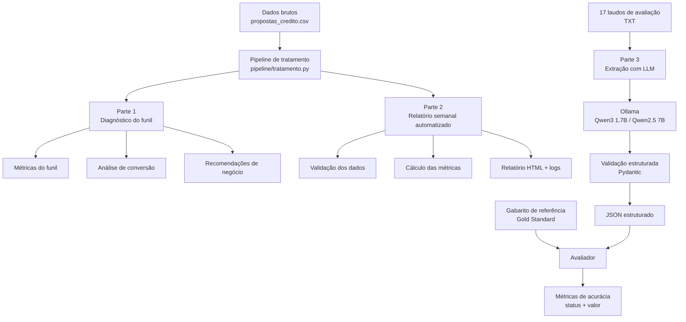

# Banco Bari — AI & Data Lab Case

Solução desenvolvida para o desafio prático do **Banco Bari — AI & Data Lab**.

O projeto analisa dados sintéticos de propostas de Home Equity, automatiza o acompanhamento semanal do funil e utiliza IA para transformar laudos de avaliação em dados estruturados.

O objetivo não foi apenas produzir análises, mas construir um processo **reproduzível, testável e auditável**, documentando também limitações, decisões de engenharia e uso de IA durante o desenvolvimento.

---

## Principais resultados

A análise do funil encontrou uma conversão geral de **19,39%**.

Os principais achados foram:

- **Análise de crédito (etapa 3)** concentra **35,1% do valor perdido**, aproximadamente **R$ 703 milhões**.
- Considerando as perdas do funil por motivo, **60,8% do valor perdido** está associado a desistência ou falta de retorno do cliente, e não diretamente à reprovação de crédito.
- A conversão caiu de **20,4% para 18,7%** no período analisado. A queda existe nos dados, mas é moderada e não foi submetida a teste de significância estatística.
- O canal **Correspondente** apresentou conversão de **14,3%**, contra aproximadamente **20–22%** nos demais canais, enquanto aumentou sua participação no volume.
- **Score de crédito** apresentou a maior associação observada com contratação, com amplitude de **30,4 pontos percentuais** entre grupos analisados, seguido por LTV e canal de origem.

Essas relações são **associações observadas nos dados**, não evidência de causalidade.

### Recomendações

**1. Follow-up ativo durante a análise de crédito**

A etapa 3 concentra **1.191 propostas** perdidas por `Sem retorno` ou `Desistiu`, que representam aproximadamente **R$ 471,7 milhões** em valor solicitado.

Em um cenário de sensibilidade no qual uma intervenção de processo recuperasse 10% desse valor, a oportunidade seria equivalente a aproximadamente **119 propostas e R$ 47,2 milhões** em crédito adicional ao longo do período analisado.

**2. Revisar o canal Correspondente**

O canal apresentou conversão inferior aos demais e participação crescente no volume.

Em um cenário no qual sua conversão alcançasse a média observada nos outros canais, a oportunidade associada seria de aproximadamente **126 propostas e R$ 48 milhões** em crédito adicional.

**3. Validar e operacionalizar a política de LTV de 60%**

A base contém **981 propostas com LTV calculado acima de 60%**, das quais **124 aparecem como contratadas**.

Antes de implementar um bloqueio automático, é necessário validar se o LTV disponível na base representa exatamente a mesma medida utilizada pela política de crédito e investigar possíveis exceções, renegociações ou mudanças de condição durante o processo.

> Os valores apresentados são cenários de oportunidade condicionados às premissas da análise, não previsões de receita nem efeitos causais medidos.

---

## Arquitetura da solução

A solução foi organizada em dois fluxos principais:

- **dados estruturados**, utilizados no diagnóstico e na automação do funil de crédito;
- **dados não estruturados**, utilizados na extração de informações dos laudos com LLMs.

O tratamento das propostas foi centralizado em um pipeline compartilhado, permitindo que o diagnóstico da Parte 1 e o relatório automatizado da Parte 2 utilizem as mesmas regras de preparação dos dados.



O primeiro fluxo busca manter consistência entre análise exploratória e automação, enquanto o segundo adiciona validação estrutural e uma etapa explícita de avaliação das extrações produzidas pelos modelos.

---

# Estrutura do projeto

```text
bari-case/
│
├── dados_brutos/
│   ├── Propostas_credito.csv
│   └── laudos_avaliacao/
│
├── pipeline/
│   ├── __init__.py
│   └── tratamento.py
│
├── parte1_diagnostico/
│   ├── 00Profilling.py
│   ├── 01_tratamento.py
│   ├── 02_comparacao_metricas.py
│   ├── 02_diagnostico_funil.py
│   ├── 03_respostas_parte1.md
│   ├── definicao_metricas.md
│   ├── diagnostico_output.txt
│   ├── profilling_output.txt
│   ├── propostas_credito_tratado.csv
│   └── registro_tratamento.md
│
├── parte2_automacao/
│   ├── README.md
│   ├── relatorio_semanal.py
│   ├── saidas/
│   └── testes/
│
├── parte3_extracao_ia/
│   ├── schema.py
│   ├── extrator.py
│   ├── extrator_local.py
│   ├── avaliador.py
│   ├── construir_gabarito.py
│   ├── gabarito.json
│   ├── decisoes.md
│   ├── README.md
│   ├── relatorio_acuracia_qwen25-7b.md
│   ├── saida_extracao_local_qwen25-7b.json
│   └── testes/
│
├── DIARIO.md
├── PLANO.md
├── RESUMO_EXECUTIVO.md
├── requirements.txt
└── README.md
```

---

# Parte 1 — Diagnóstico do funil

A primeira etapa realiza profiling, tratamento e análise das propostas de crédito.

O fluxo foi separado em:

```text
dados brutos
    ↓
profiling
    ↓
tratamento
    ↓
definição das métricas
    ↓
diagnóstico do funil
    ↓
recomendações
```

As transformações realizadas são registradas em:

```text
parte1_diagnostico/registro_tratamento.md
```

As respostas consolidadas da Parte 1 estão em:

```text
parte1_diagnostico/03_respostas_parte1.md
```

Uma preocupação durante essa etapa foi evitar que a limpeza dos dados alterasse silenciosamente os resultados do negócio.

Por isso, foram feitas comparações entre métricas antes e depois do tratamento.

---

# Parte 2 — Automação do relatório semanal

A Parte 2 transforma a análise em um processo automatizado.

O pipeline recebe o CSV, valida sua estrutura, aplica o tratamento compartilhado e gera um relatório HTML do funil.

```text
CSV
 ↓
validação
 ↓
tratamento
 ↓
cálculo das métricas
 ↓
relatório HTML
 ↓
log da execução
```

A automação possui tratamento explícito para situações como:

- colunas ausentes;
- formatos inválidos;
- IDs duplicados;
- registros incompletos;
- CSV vazio;
- mudanças de schema;
- semana sem propostas;
- falhas durante a geração do relatório;
- reexecução do pipeline.

Um exemplo de saída está disponível em:

```text
parte2_automacao/saidas/relatorio_2026-09-14_2026-09-20.html
```

A documentação específica da automação está em:

```text
parte2_automacao/README.md
```

---

# Parte 3 — Extração estruturada com IA

A terceira etapa transforma **17 laudos de avaliação em texto livre** em dados estruturados.

São extraídos 10 campos:

- tipo de imóvel;
- endereço;
- área privativa;
- área total;
- ano de construção;
- valor de avaliação;
- matrícula;
- ônus;
- data da vistoria;
- responsável técnico.

Cada campo possui uma estrutura contendo:

```text
valor
status
trecho_bruto
```

O `trecho_bruto` preserva evidência textual do documento para permitir auditoria dos resultados.

## Critério de avaliação

Foi construído um **gabarito de referência** para os 17 laudos.

O avaliador compara cada campo extraído com esse gabarito e normaliza representações equivalentes de números e datas antes de classificá-las como divergências.

Essa abordagem permite separar dois problemas diferentes:

1. o modelo identificou corretamente se a informação estava presente, ausente ou conflitante?
2. quando presente, o valor extraído estava correto?

Isso evita considerar uma extração correta apenas porque o modelo produziu uma saída estruturalmente válida.

## Qwen3 1.7B

A primeira execução completa utilizou **Qwen3 1.7B** via Ollama.

Resultado:

```text
17/17 laudos processados
92,4% de acurácia geral de status
```

O modelo menor foi escolhido inicialmente devido à limitação de hardware disponível, uma NVIDIA GT 1030 com 2 GB de VRAM.

Essa execução também revelou problemas importantes no próprio pipeline, incluindo uma validação que permitia `status="presente"` com `valor=None` e limitações na normalização utilizada pelo avaliador.

Esses problemas foram corrigidos e transformados em testes de regressão.

## Qwen2.5 7B

Posteriormente, o mesmo experimento foi executado em uma máquina com NVIDIA RTX 3050 de 4 GB utilizando **Qwen2.5 7B**.

Resultado:

```text
17/17 laudos processados
92,9% de acurácia geral de status
```

A diferença para o Qwen3 1.7B foi de apenas **0,5 ponto percentual** na métrica agregada de status.

A avaliação por campo mostrou, entretanto, diferenças importantes.

No Qwen2.5 7B, por exemplo:

```text
area_privativa_m2        70,6%
endereco                100,0%
valor_avaliacao_reais   100,0%
matricula               100,0%
responsavel_tecnico     100,0%
```

Esses valores correspondem à **acurácia de status** desses campos no conjunto avaliado.

Além disso, a análise mostrou que um `status` correto não implica necessariamente que o conteúdo extraído esteja correto.

Por isso, a comparação entre modelos não foi reduzida a uma conclusão de que o modelo maior é universalmente superior.

A amostra contém apenas 17 laudos, e existem diferenças importantes entre:

```text
acurácia de status
        ≠
acurácia do valor
```

Os resultados completos estão em:

```text
parte3_extracao_ia/relatorio_acuracia_qwen25-7b.md
```

As decisões de modelagem, erros encontrados e limitações estão documentadas em:

```text
parte3_extracao_ia/decisoes.md
```

Também foi implementado um pipeline alternativo utilizando a API da Anthropic.

Essa implementação foi validada estruturalmente, mas **não foi executada contra a API real durante o desafio**. Portanto, não é feita uma comparação experimental de acurácia entre Anthropic e os modelos locais.

---

# Testes automatizados

O projeto possui testes automatizados para as Partes 2 e 3.

Na execução final:

```text
Parte 2: 35 testes aprovados
Parte 3: 31 testes aprovados

Total: 66 testes aprovados
```

A suíte completa foi executada com:

```bash
python -m pytest -v
```

e terminou com:

```text
66 passed
```

Os testes cobrem, entre outros pontos:

- validação do CSV;
- mudanças e erros de schema;
- duplicidades;
- registros incompletos;
- geração segura do HTML;
- reexecução da automação;
- preservação da saída anterior em caso de falha;
- normalização de números e datas;
- avaliação das extrações;
- validação Pydantic;
- parsing das respostas do modelo;
- retry de respostas inválidas;
- detecção de laudos ausentes;
- regressões encontradas durante o desenvolvimento.

---

# Como executar

## 1. Clonar o repositório

```bash
git clone https://github.com/vicvictorius/bari-case.git
cd bari-case
```

## 2. Criar ambiente virtual

### Windows — PowerShell

```powershell
python -m venv .venv
.venv\Scripts\Activate.ps1
```

### Linux/macOS

```bash
python -m venv .venv
source .venv/bin/activate
```

## 3. Instalar dependências

```bash
pip install -r requirements.txt
```

---

## Executar a Parte 1

Os scripts estão organizados em ordem de execução dentro de:

```text
parte1_diagnostico/
```

Os principais artefatos gerados e utilizados na análise também estão preservados nessa pasta.

---

## Executar a Parte 2

A automação semanal pode ser executada a partir da raiz do projeto.

```bash
python parte2_automacao/relatorio_semanal.py
```

Consulte:

```text
parte2_automacao/README.md
```

para os parâmetros disponíveis, regras de validação, comportamento em caso de erro e detalhes do relatório.

---

## Executar a Parte 3

A execução local da Parte 3 requer o **Ollama** e um modelo compatível instalado.

A documentação completa está disponível em:

```text
parte3_extracao_ia/README.md
```

Ela contém instruções para:

- instalar e configurar o modelo;
- executar a extração;
- selecionar o modelo;
- gerar a saída estruturada;
- executar o avaliador;
- interpretar o relatório de acurácia.

---

## Executar os testes

Com o ambiente virtual ativo:

```bash
python -m pytest -v
```

Também é possível executar cada conjunto separadamente.

Parte 2:

```bash
python -m pytest parte2_automacao/testes -v
```

Parte 3:

```bash
python -m pytest parte3_extracao_ia/testes -v
```

---

# Decisões e limitações

Algumas limitações foram mantidas explicitamente na entrega:

- as estimativas financeiras dependem de premissas e representam oportunidades, não previsões;
- a queda observada de conversão não foi submetida a teste de significância estatística;
- associação entre características e contratação não implica causalidade;
- a avaliação de IA utiliza apenas 17 laudos;
- o gabarito da Parte 3 foi revisado por uma única pessoa;
- determinados campos apresentaram erros recorrentes nos modelos locais;
- o schema atual possui apenas `presente`, `ausente` e `conflitante`;
- informações declaradas por uma parte, mas não verificadas documentalmente, ainda não possuem um estado próprio no schema;
- a implementação da API Anthropic foi testada estruturalmente, mas não executada contra a API real.

Uma evolução considerada para o schema seria adicionar um quarto estado:

```text
nao_verificado
```

Isso permitiria diferenciar uma informação realmente aferida de uma informação apenas declarada por uma fonte não verificada.

Esses pontos são discutidos com mais detalhes no Diário e no documento de decisões da Parte 3.

---

# Uso de IA

IA foi utilizada tanto como **assistente de desenvolvimento** quanto como **componente da solução**.

Durante o projeto, sugestões produzidas por IA foram verificadas contra dados, comportamento do pipeline e testes automatizados.

Alguns erros encontrados durante o desenvolvimento levaram a mudanças concretas, incluindo:

- correção da validação entre `status` e `valor` na extração estruturada;
- melhoria da normalização utilizada pelo avaliador;
- criação de testes de regressão para erros encontrados durante execuções reais;
- revisão crítica das estimativas e recomendações produzidas na análise do funil.

O uso de IA, os erros encontrados, os aprendizados e a autocrítica estão registrados em:

```text
DIARIO.md
```

---

# Tempo de desenvolvimento

O desenvolvimento do case levou aproximadamente **10h30 a 11h30**, distribuídas da seguinte forma:

| Etapa | Tempo aproximado |
|---|---:|
| Parte 1 — Diagnóstico do funil | 3–4h |
| Parte 2 — Automação | 2h |
| Parte 3 — Extração com IA | 4h |
| Parte 4 — Diário e autocrítica | 1h30 |
| **Total** | **10h30–11h30** |

O tempo inclui análise dos dados, implementação, testes, investigação de erros, experimentação com modelos locais e documentação das decisões.

---

# Resumo executivo

Uma versão direcionada à liderança comercial, sem necessidade de abrir o código, está disponível em:

```text
RESUMO_EXECUTIVO.md
```

O documento consolida os principais achados do funil, oportunidades identificadas, recomendações e premissas utilizadas.

---

# Tecnologias

- Python 3
- pandas
- Pydantic
- pytest
- Ollama
- Qwen3 1.7B
- Qwen2.5 7B
- Anthropic SDK
- HTML
- JavaScript
- Git
- GitHub

---

# Dados

Todos os dados utilizados neste desafio são **sintéticos**.

Nenhum dado real de cliente do Banco Bari foi utilizado.

---

# Autor

**Victor**

GitHub: [vicvictorius](https://github.com/vicvictorius)

Repositório do projeto: [bari-case](https://github.com/vicvictorius)